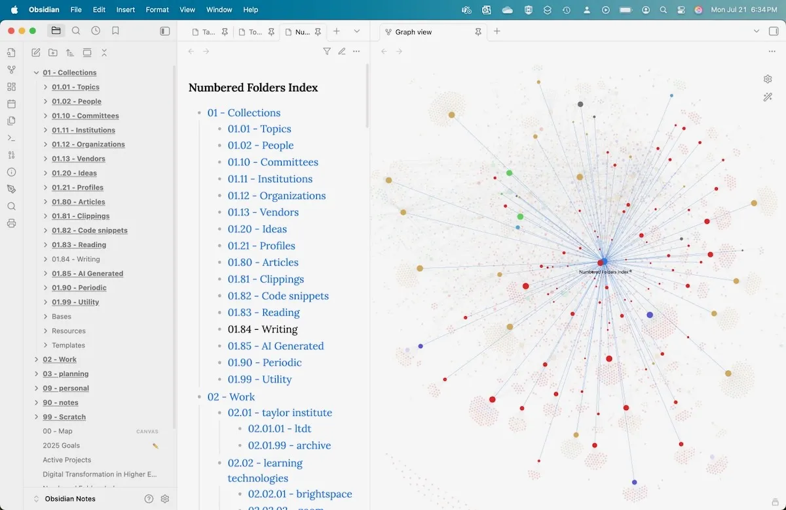

# numbered-folders-index
An Obsidian plugin that generates an index (or MOC) for any zettelkasten-style numbered folders.

This plugin was generated using Claude Sonnet 4. Because it's AI slop, I haven't submitted it to the main Obsidian plugin repository. I've checked the code and it looks safe, but there's no warranty on this plugin. Caveat emptor, etc.

I have no idea if this will be useful to anyone. I've been finding it useful.

# How it works
The plugin looks for zettelkasten-style numbered folders, and adds them to a note called "Numbered Folders Index". 

In my Vault, I have folders organized like this:

- 01 - Collections
- 02 - Work
- 03 - planning

etc.

In Collections, I have nested folders like:

- 01.01 - Topics
- 01.02 - People
- 01.10 - Committees
- 01.11 - Institutions
- 01.20 - Ideas
- 01.80 - Articles
- 01.81 - Clippings
- 01.82 - Code snippets

etc.

So, those are actually nested like:

- 01 - Collections
	- 01.01 - Topics
	- 01.02 - People
	- 01.10 - Committees
	- 01.11 - Institutions
	- 01.20 - Ideas
	- 01.80 - Articles
	- 01.81 - Clippings
	- 01.82 - Code snippets

etc.

And this keeps going, for something like:

- 02 - Work
	- 02.02 - learning technologies
		- 02.02.01 - brightspace

etc. 

I have some that are nested 4 levels deep.

I also have some folders that start with a year, like "2022 videoconferencing" - and these aren't included in the index. Only folders that use the ##.##.##.## format get included.

Additionally, I use the [Folder Notes Plugin](https://github.com/LostPaul/obsidian-folder-notes) by Lost Paul, to generate notes for specific folders. Sometimes, they include additional info. Sometimes, they include dataviews and other useful tools. If a folder note exists for a numbered folder, the Numbered Folders Index page will link directly to it. Handy.

# Using the plugin
If you organize your Obsidian Vault using numbered folders ala zettelkasten, this might work for you.

The Numbered Folders Index note gets generated (or refreshed) when the plugin is activated. There is also a Command to refresh the index on demand - "Numbered Folders Index: Regenerate numbered folders index", which does what it says on the tin.

The plugin isn't customizable in any way (other than modifying the code). There aren't any settings or configuration options.

One potential issue is if you already have a note named "Numbered Folders Index" at the root of your Vault. This plugin will overwrite that file. There isn't a config setting to change the note used for the index.

## But the Files sidebar does this!

Kind of. But it's handy to have a page with the links (for reference), and the index feed The Graph™ to help make connections based on the zettelkasten folder structure.

## But this could have been done with Dataview or DataviewJS! 
Yup. I did that initially. But those don't feed into The Graph™, and the view refreshes pretty often. Adding numbered folders doesn't happen very often, so running it once in a while is more than enough.
